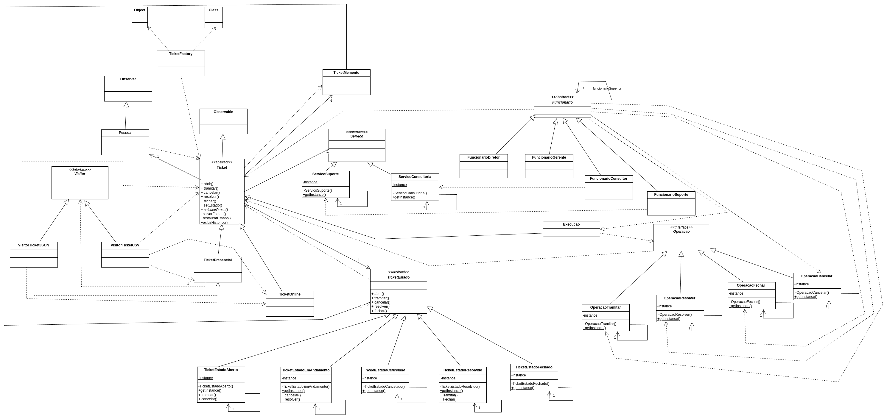
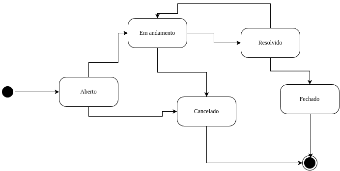

# Sistema de Ticket - Padrões de Projeto

Este é um projeto que implementa diversos padrões de projeto para gerenciar eficientemente o ciclo de vida dos tickets. O sistema permite a criação, gestão e tratamento de tickets de suporte, garantindo flexibilidade, extensibilidade e manutenção eficiente.

---

## Padrões de Projeto Utilizados

- **Factory Method**: Responsável pela criação dos tickets de forma padronizada.
- **Singleton**: Garante que os serviços de suporte e consultoria tenham apenas uma instância ativa.
- **Observer**: Mantém os solicitantes informados sobre mudanças no estado do ticket.
- **State**: Gerencia dinamicamente os estados dos tickets (Aberto, Em Andamento, Fechado, etc.).
- **Bridge**: Separa a abstração dos tickets de sua implementação concreta.
- **Template Method**: Define um esqueleto para o cálculo de prazos dos tickets.
- **Visitor**: Permite operações externas sobre os tickets sem modificar suas classes.
- **Memento**: Captura e restaura o estado de um ticket para manter um histórico de alterações.
- **Chain of Responsibility**: Cria uma cadeia de responsabilidade no tratamento dos tickets.
- **Strategy**: Define diferentes estratégias para o tratamento de tickets pelos funcionários.

---

## Diagrama de Classes

---

## Diagrama de Estados

